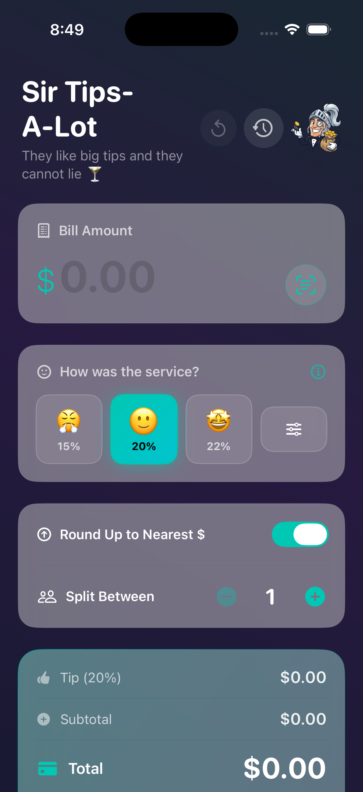
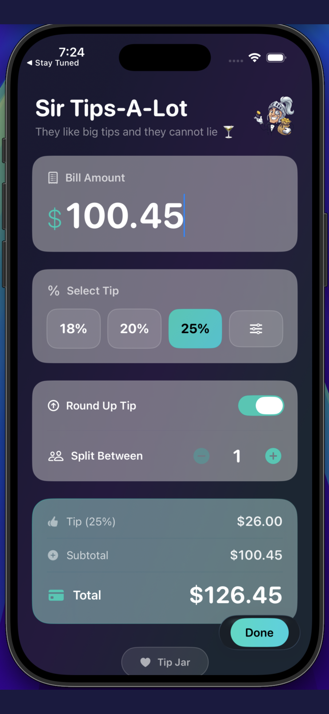
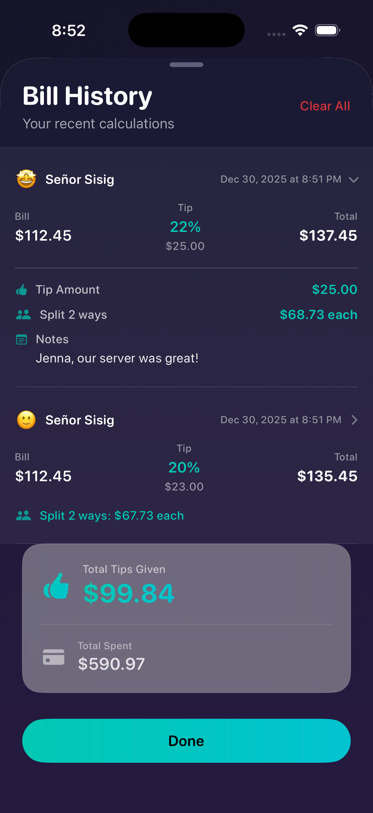

# Sir Tips-A-Lot 🎩💰

<p align="center">
  
</p>

A beautiful, smart tip calculator app for iOS built with SwiftUI — featuring receipt scanning, sentiment-based tipping, and location-aware bill history.

This is my first iOS application.


## ✨ Features

### Core Calculator
- 💵 **Quick Tip Calculation** — Enter your bill and instantly see the tip
- 📈 **Round Up Tip** — Round your tip to the nearest dollar
- 👥 **Split the Bill** — Divide among any number of people with per-person breakdown
- 📷 **Auto scan your check** — Scan your check with your camera to auto populate ammounts and reccomended tip.  Auto detects checks that already have gratuity added as well!

### 🎭 Sentiment-Based Tipping
- **Emoji Selection** — Rate service with 😢 (Meh), 😐 (OK), or 🤩 (Great)
- **Customizable Percentages** — Set your own tip percentages for each sentiment
- **Custom Emojis** — Change the emojis to whatever you prefer

### 📸 Receipt Scanning
- **Camera OCR** — Scan your receipt to auto-populate the bill amount
- **Smart Detection** — Automatically detects subtotal, total, and gratuity
- **Pre-included Gratuity** — Recognizes when tip is already on the bill

### 📍 Location Intelligence
- **Venue Auto-Detection** — Saves restaurant name with your bills automatically
- **Privacy-First** — Location data stays on your device, never shared
- **Optional** — Full control to enable/disable in settings

### 📜 Bill History
- **Detailed Records** — View past bills with tip, total, location, and sentiment
- **Editable Entries** — Modify saved bills anytime
- **Notes Field** — Add personal notes to remember the occasion
- **Lifetime Stats** — Track your total tips and spending over time

### 🌍 Multi-Currency Support
- USD, EUR, GBP, CAD, AUD, JPY, CHF, MXN, INR
- Easy switching in Settings

### 🎨 Beautiful Design
- 🌙 **Dark UI** — Modern glassmorphism with animated gradients
- ✨ **Smooth Animations** — Polished transitions and haptic feedback
- 🚀 **Splash Screen** — Branded launch experience

## Screenshots

<p align="center">
  
  
  
</p>

| Main Screen | Tip Calculation | Split Bill |
|:-----------:|:---------------:|:----------:|
| Enter your bill amount | Rate service with emojis | Split between multiple people |

## Requirements

- iOS 17.0+
- Xcode 15.0+
- Swift 5.9+

## Installation

1. Clone the repository:
   ```bash
   git clone https://github.com/nickmaccarthy/sir-tips-a-lot.git
   ```

2. Open the project in Xcode:
   ```bash
   cd sir-tips-a-lot
   open "TipCal/Tip Calculator/Tip Calculator.xcodeproj"
   ```

3. Build and run on your device or simulator

## Project Structure

```
TipCal/Tip Calculator/Tip Calculator/
├── Tip_CalculatorApp.swift           # App entry point with launch flow
├── ContentView.swift                 # Main calculator UI
├── TipCalculatorViewModel.swift      # MVVM ViewModel with business logic
├── Models/
│   ├── SavedBill.swift              # Bill history data model
│   └── Currency.swift               # Multi-currency support
├── Views/
│   ├── SettingsView.swift           # Settings & preferences
│   ├── ScannerView.swift            # Receipt scanning UI
│   ├── VisionScannerView.swift      # Enhanced Vision scanner
│   ├── EditBillView.swift           # Edit saved bills
│   ├── SplashScreenView.swift       # Launch animation
│   ├── LocationOnboardingView.swift # Location permission flow
│   └── LocationPickerView.swift     # Manual location selection
├── Services/
│   ├── LocationManager.swift        # CoreLocation integration
│   ├── StoreManager.swift           # In-app purchases
│   └── TipProduct.swift             # Tip jar products
├── Assets.xcassets/                 # Images and colors
└── scripts/
    └── increment_build.sh           # Auto-increment build number
```

## Architecture

This app follows the **MVVM (Model-View-ViewModel)** pattern:

- **View** (`ContentView.swift`, `Views/`) — SwiftUI views and UI components
- **ViewModel** (`TipCalculatorViewModel.swift`) — Business logic, state management, location services
- **Model** (`Models/`) — Data structures for bills, currency, and persistence

## Customization

### Tip Percentages

Customize tip percentages for each sentiment in **Settings** (tap the knight icon):
- 😢 Meh Service — Default 15%
- 😐 OK Service — Default 18%
- 🤩 Great Service — Default 22%

### Payment Links (Tip Jar)

To use your own payment links, update the variables in `TipJarView` within `ContentView.swift`:

```swift
let venmoUsername = "YourVenmoUsername"
let cashAppUsername = "$YourCashTag"
let paypalUsername = "YourPayPalUsername"
```

### App Icon

Replace the images in `Assets.xcassets/AppIcon.appiconset/` with your own 1024x1024 icon.

## Running Tests

```bash
xcodebuild test \
  -project "TipCal/Tip Calculator/Tip Calculator.xcodeproj" \
  -scheme "Tip Calculator" \
  -destination 'platform=iOS Simulator,OS=latest,name=iPhone 17 Pro'
```

## Contributing

Contributions are welcome! Please feel free to submit a Pull Request.

## License

This project is licensed under the MIT License - see the [LICENSE](LICENSE) file for details.

## Author

**Nick MacCarthy**
- Email: nickmaccarthy@gmail.com
- Venmo: @NickMacCarthy

## Acknowledgments

- Built with SwiftUI
- Icons from SF Symbols
- Receipt scanning powered by Apple Vision framework
- Location services via CoreLocation

---

*"They like big tips and they cannot lie"* 🍸
